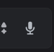
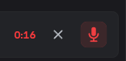

# Voice Message (Discord Web)

<!-- shields -->
[][greasyfork_url]

<!-- end shields -->

A [Tampermonkey](https://www.tampermonkey.net/) userscript that adds a **voice‑message recorder** to Discord's web client. Click to record, click to send — voice messages that play correctly on both desktop **and** mobile.

> Discord's web client has no built‑in voice‑message button. This script adds one to the chat toolbar, records Opus audio, repackages it into the Ogg container Discord's mobile player requires, and uploads it through Discord's official voice‑message flow.

<!-- Replace with a real screenshot / GIF once you have one -->

---

## Features

- 🎙️ **One‑click record** — click the mic to start, click again to stop and send.
- ✖️ **Cancel anytime** — discard a recording without sending it.
- ⏱️ **Live timer** while recording, with a minimum‑length guard (won't send sub‑1s blips).
- 📱 **Plays on mobile** — records WebM/Opus, then remuxes to Ogg/Opus in‑browser (no re‑encode, no dependencies) so Discord mobile can decode it.
- 📊 Generates the **waveform + duration** metadata Discord shows on voice messages.
- 🔔 Non‑blocking, Discord‑styled toast notifications.
- 🎨 Native‑looking toolbar button that adapts to your Discord theme.

---

## Install

1. Install the [Tampermonkey](https://www.tampermonkey.net/) browser extension (Chrome, Edge, Firefox, etc.).
2. Click to install the script:

   **➡️ [Install voice-message.user.js](https://raw.githubusercontent.com/vic10us/discord-voice-message/main/voice-message.user.js)**

   Tampermonkey will open an install page — click **Install**.
3. Open or reload [Discord Web](https://discord.com/app). A microphone button appears in the chat toolbar next to the emoji/GIF buttons.

> Updates install automatically via Tampermonkey (`@updateURL`).

Easy Install :  
  [![][greasyfork_icon]][greasyfork_url]

---

## Usage

1. Open any channel or DM.
2. **Click the 🎙️ mic button** to start recording — it pulses red and a timer appears.
3. **Click it again** to stop and send.
4. To throw a recording away, click the **✖️ cancel** button that appears while recording.

Recordings shorter than **1 second** are discarded automatically. Recording auto‑stops and sends at the **10‑minute** safety limit.

---

## How it works

| Piece | What it does |
|-------|--------------|
| **Auth token** | Read via a throwaway iframe's `localStorage`, with a webpack‑module scan fallback (Discord shuffles the export shape between builds). |
| **Recording** | `MediaRecorder` captures Opus audio (WebM container on Chromium, Ogg on Firefox). |
| **Remux** | On Chromium, the WebM is repackaged into an **Ogg/Opus** container in pure JS — same audio frames, just a different wrapper. This is why it plays on mobile (Discord mobile only decodes Ogg/Opus). |
| **Upload** | Uses Discord's 3‑step voice‑message flow: reserve a cloud slot → `PUT` to the signed URL → post the message with `flags: 8192`, `duration_secs`, and `waveform`. |

Everything runs client‑side with no external dependencies and no network calls beyond Discord's own API — it stays within Discord's CSP.

---

## Troubleshooting

- **Button doesn't appear** — reload the page. If still missing, set `DEBUG = true` at the top of the script and check the console for `Buttons container not found`.
- **"missing auth token"** — Discord changed something. Enable `DEBUG` and look for `webpack scan found no getToken export`; open an issue if you see it.
- **Sends but silent on mobile** — check the console for `Remuxed WebM/Opus -> Ogg/Opus`. If you see a remux error instead, open an issue with the message.
- **Verbose logging** — flip `let DEBUG = false;` to `true` near the top of the script.

---

## ⚠️ Disclaimer

This script reads and uses your own Discord account token to call Discord's API directly. Automating a user account this way is against Discord's Terms of Service and could put your account at risk. Use it at your own risk, on your own account. This project is for educational purposes and is not affiliated with or endorsed by Discord.

---

## License

[MIT](LICENSE) © vic10us

<!-- links -->
  [self-bots]: https://support.discordapp.com/hc/en-us/articles/115002192352-Automated-user-accounts-self-bots-
  [userscrips_faq]: https://en.wikipedia.org/wiki/Userscript
  [greasyfork_icon]: https://user-images.githubusercontent.com/3372598/166113712-1bc3d654-1342-4f1e-9845-21c3b21524b1.png
  [openuserjs_icon]: https://user-images.githubusercontent.com/3372598/166113714-5a2ede39-8d66-43a8-b5da-8f1897cb3121.png
  [greasyfork_moderation]: https://greasyfork.org/en/moderator_actions

  [issues]: https://github.com/vic10us/discord-voice-message/issues
  [issues_open]: https://github.com/vic10us/discord-voice-message/issues
  [issues_closed]: https://github.com/vic10us/discord-voice-message/issues
  [prs]: https://github.com/vic10us/discord-voice-message/pulls
  [pr_open]: https://github.com/vic10us/discord-voice-message/pulls
  [prs_closed]: https://github.com/vic10us/discord-voice-message/pulls
  [forks]: https://github.com/vic10us/discord-voice-message/network/members

  [wiki]: https://github.com/vic10us/discord-voice-message/wiki
  [discussions]: https://github.com/vic10us/discord-voice-message/discussions
  [ideas]: https://github.com/vic10us/discord-voice-message/discussions/categories/2-ideas
  [questions]: https://github.com/vic10us/discord-voice-message/discussions/categories/1-questions-answers
  [security_policy]: https://github.com/vic10us/discord-voice-message/wiki/Security-Policy

<!-- Extensions -->
  [chrome_violentmonkey]: https://chrome.google.com/webstore/detail/violent-monkey/jinjaccalgkegednnccohejagnlnfdag
  [chrome_tampermonkey]: https://chrome.google.com/webstore/detail/tampermonkey/dhdgffkkebhmkfjojejmpbldmpobfkfo
  [firefox_greasemonkey]: https://addons.mozilla.org/firefox/addon/greasemonkey/
  [firefox_tampermonkey]: https://addons.mozilla.org/firefox/addon/tampermonkey/
  [firefox_violentmonkey]: https://addons.mozilla.org/firefox/addon/violentmonkey/
  [safari_tampermonkey]: https://github.com/vic10us/discord-voice-message/issues/91#issuecomment-654514364
  [edge_tampermonkey]: https://microsoftedge.microsoft.com/addons/detail/tampermonkey/iikmkjmpaadaobahmlepeloendndfphd
  [opera_tampermonkey]: https://addons.opera.com/extensions/details/tampermonkey-beta/
  [opera_violentmonkey]: https://addons.opera.com/extensions/details/violent-monkey/

<!-- Download links -->
  [greasyfork_url]: <https://greasyfork.org/en/scripts/581949-voice-message-discord-web> "Get discord-voice-message from GreasyFork"
  [openuserjs_url]: <https://greasyfork.org/en/scripts/581949-voice-message-discord-web> "Get discord-voice-message from OpenUserJS"

  [brave_browser]: https://brave.com/download/
